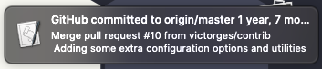
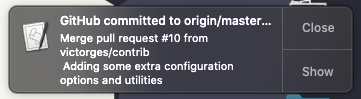

<div align="center">
<p align="center">
  <p align="center">
    <h3 align="center">Git Notify</h3>
    <p align="center">
      Watch a <code>git</code> repo and alert you of new commits.
    </p>
  </p>
</p>
</div>

## About

Born from lacking answers after asking about [any tools that can notify about commits to remote git repos on StackOverflow](http://stackoverflow.com/questions/5082001/is-there-a-tool-to-watch-a-remote-git-repository-on-ubuntu-and-do-popup-notificat).

## Installation

Just download `git-notify` and ensure it's folder is located in your path:

```bash
git clone https://github.com/losuler/git-notify
# If you use bash
echo "export PATH=/your/full/path/to/git-notify:\$PATH" >> ~/.bashrc && source ~/.bashrc
# If you use zshrc
echo "export PATH=/your/full/path/to/git-notify:\$PATH" >> ~/.zshrc && source ~/.zshrc
```

## Usage

```
Usage: git-notify [OPTION]...
Watch git repos and be notified upon detection of new commits.

  -b BRANCH     Specifies the branch to run against (default origin/master)
  -r REPOSITORY Specify what repository to watch (default origin/master)
  -t TIME       Time to wait inbetween checking, in seconds (default 60)
  -c PATH       Path to the config file
  -a            Runs the job in the background (via &)
  -v            Set verbose logging on (adds "[date]: " prefix)
  -l            Find all git-notify background jobs currently running
  -k            Kill all backgrounded git-notify jobs
  -h            Print help and exit
```

Intended to be run from the base of a local cloned Github repository you are interested in monitoring.

## macOS

If you want to change the AppleScript notification type, that is a setting that is controlled in your `System Preferences` ➝ `Notifications` tab. `git-notify` will use the `Script Editor` application, so you should modify those settings.

By default, `Script Editor` uses the `Banners` type message. Switching to the `Alerts` tab will allow for notifications that have a `Close` button to be dismissed individually.

<table>
  <tr>
    <td></td>
    <td></td>
  </tr>
</table>
